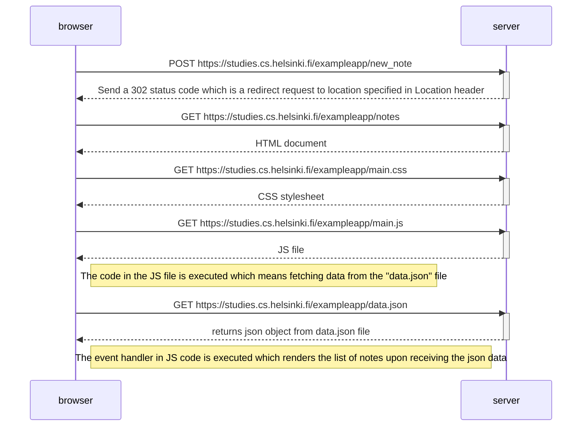

```mermaid
sequenceDiagram
    participant browser
    participant server

    browser->>server: POST  https://studies.cs.helsinki.fi/exampleapp/new_note
    activate server
    server-->>browser: Send a 302 status code which is a redirect request to location specified in Location header
    deactivate server

    browser->>server: GET https://studies.cs.helsinki.fi/exampleapp/notes
    activate server
    server-->>browser: HTML document
    deactivate server

    browser->> server: GET https://studies.cs.helsinki.fi/exampleapp/main.css
    activate server
    server-->> browser: CSS stylesheet
    deactivate server

    browser->> server: GET https://studies.cs.helsinki.fi/exampleapp/main.js
    activate server
    server-->> browser: JS file
    deactivate server

    Note right of browser: The code in the JS file is executed which means fetching data from the "data.json" file

    browser->> server: GET https://studies.cs.helsinki.fi/exampleapp/data.json
    activate server
    server-->> browser: returns json object from data.json file
    deactivate server

    Note right of browser: The event handler in JS code is executed which renders the list of notes upon receiving the json data
```
