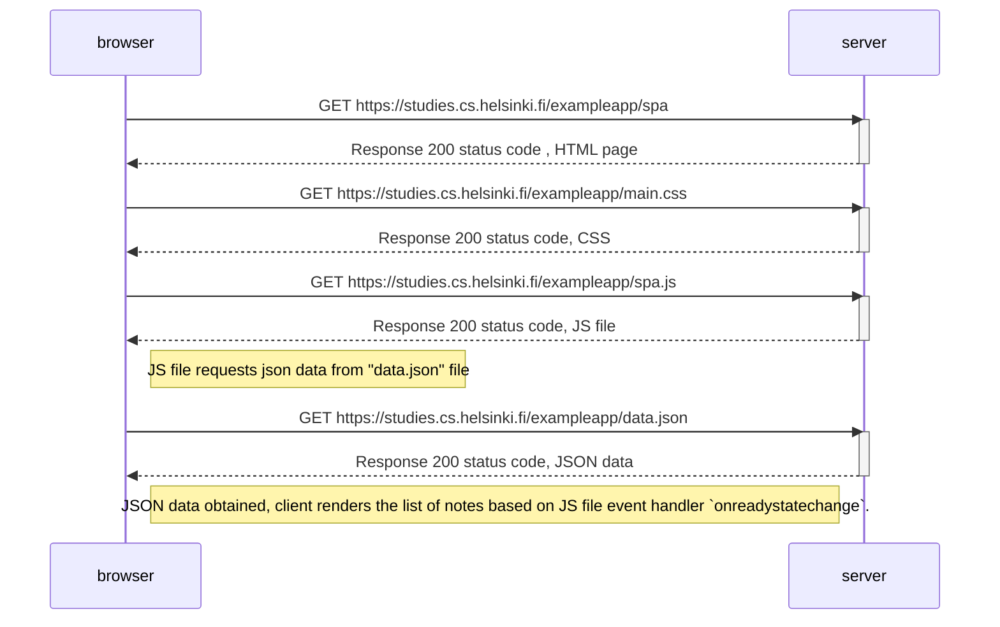

```mermaid
sequenceDiagram
    participant browser
    participant server

    browser->>server: GET https://studies.cs.helsinki.fi/exampleapp/spa
    activate server
    server-->>browser: Response 200 status code , HTML page
    deactivate server

    browser->>server: GET https://studies.cs.helsinki.fi/exampleapp/main.css
    activate server
    server-->>browser: Response 200 status code, CSS
    deactivate server

    browser->>server: GET https://studies.cs.helsinki.fi/exampleapp/spa.js
    activate server
    server-->>browser: Response 200 status code, JS file
    deactivate server

    Note right of browser: JS file requests json data from "data.json" file

    browser->>server: GET https://studies.cs.helsinki.fi/exampleapp/data.json
    activate server
    server-->>browser: Response 200 status code, JSON data
    deactivate server

    Note right of browser: JSON data obtained, client renders the list of notes based on JS file event handler `onreadystatechange`.
```